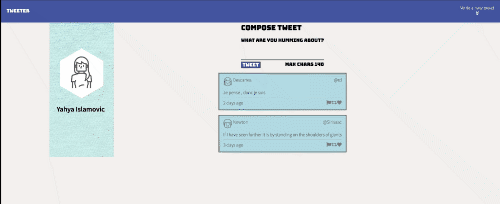
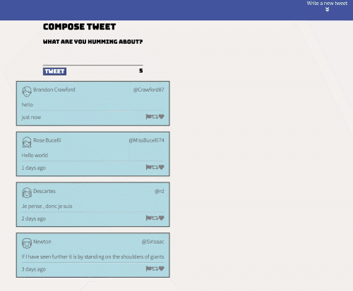

# Tweeter Project

Tweeter is a simple, single-page Twitter clone.

## Getting Started

1. Fork this repository, then clone your fork of this repository.
2. Install dependencies using the `npm install` command.
3. Start the web server using the `npm run local` command. The app will be served at <http://localhost:8080/>.
4. Go to <http://localhost:8080/> in your browser.

## Final Product

## Dependencies

- Express
- Node 5.10.x or above
- body-parser 1.15.2
- chance 1.0.2
- express 4.13.4
- jquery 3.6.0,
- md5 2.1.0,
- timeago.js 4.0.2

## Getting Started

- Install all dependencies (using the `npm install` command).
- Run the development web server using the `node express_server.js` command.

